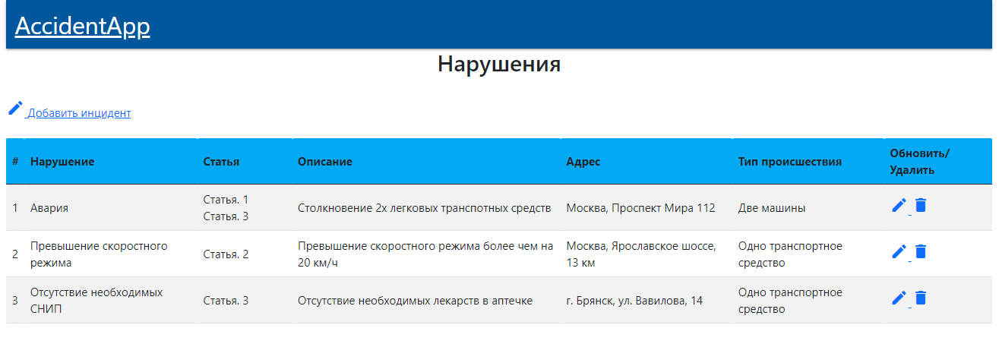
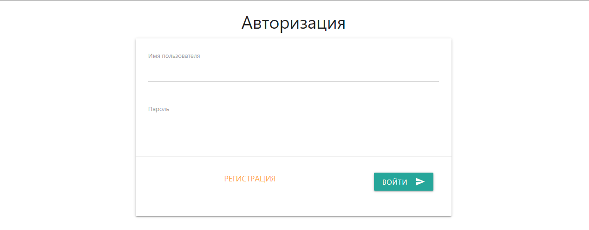
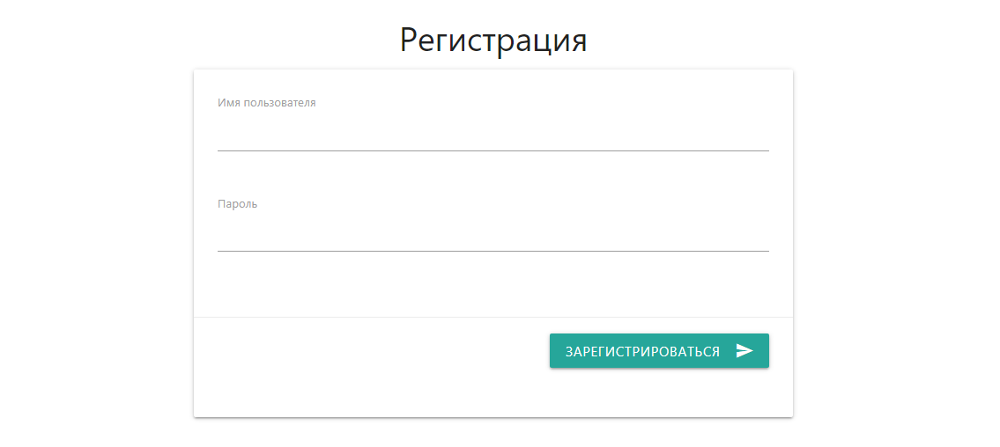

# job4j_car_accident
Проект "Автонарушители" [job4j](https://job4j.ru/).

### Этот проект представляет веб приложение для ведения учета новых правонарушений и отслеживание их приема/рассмотрения.

#### Функциональность:

- CRUD операции для заявок

- Веб интерфейс для создания/редактирования заявок

#### Используемые технологии:

- ORM Hibernate 5.4.

- Spring MVC 5.1.2.

- Spring Security 5.1.2.

- Javascript, Jquery, AJAX для отображения заявок

- Postgresql 13.2

### Главная страница приложения

### Авторизация пользователя

### Регистрация пользователя

